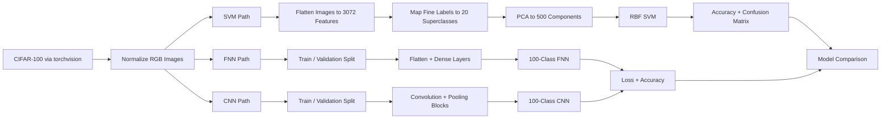

# CIFAR-100 Image Classification

## Purpose

Build and compare multiple machine learning approaches for image classification on CIFAR-100. The project explores three modeling strategies: a Support Vector Machine baseline using PCA-reduced flattened image features, a feed-forward neural network baseline in PyTorch, and a convolutional neural network designed for image feature extraction.

The notebooks show how model choice changes performance on a difficult fine-grained image classification task.

## Problem Solved and Benefits

CIFAR-100 is a challenging benchmark because it contains 100 visually similar fine-grained object classes in very small `32 x 32` RGB images. A model must learn useful visual patterns despite low image resolution and high class granularity.

This project helps explore that challenge by:

- Loading CIFAR-100 directly through `torchvision`.
- Normalizing image tensors for model training.
- Comparing classical machine learning with neural network approaches.
- Reducing flattened image dimensionality with PCA for SVM training.
- Training a feed-forward neural network as a non-convolutional deep learning baseline.
- Training a convolutional neural network that can learn spatial image features.
- Evaluating models with accuracy, loss, and confusion matrices.
- Saving trained model artifacts for later experimentation.

## What I Built

- SVM notebook: `SVM.ipynb`
  - Flattens CIFAR-100 images from `3 x 32 x 32` into 3,072 features.
  - Converts fine labels into 20 CIFAR-100 superclasses.
  - Applies label encoding.
  - Uses PCA to reduce image vectors to 500 components.
  - Trains an RBF-kernel SVM with class balancing.
  - Evaluates with accuracy and a confusion matrix.
- FNN notebook: `FNN.ipynb`
  - Builds a PyTorch feed-forward neural network for 100 fine classes.
  - Uses batch normalization and dropout.
  - Trains with cross-entropy loss and Adam.
  - Saves the best model state.
  - Evaluates on the CIFAR-100 test set.
- CNN notebook: `CNN.ipynb`
  - Builds a PyTorch convolutional neural network for 100 fine classes.
  - Uses convolutional blocks, batch normalization, ELU activations, max pooling, dropout, and dense layers.
  - Tracks validation loss and accuracy.
  - Uses early stopping behavior.
  - Saves the best model state and evaluates test accuracy.
- Media assets:
  - Training curves and result images are stored in the `media/` folder.

## Project Architecture



## Dataset

The project uses CIFAR-100 through `torchvision.datasets.CIFAR100`.

Dataset summary:

| Property | Value |
| --- | --- |
| Images | 60,000 |
| Training images | 50,000 |
| Test images | 10,000 |
| Image size | 32 x 32 |
| Channels | 3 RGB channels |
| Fine classes | 100 |
| Superclasses | 20 |

CIFAR-100 contains fine-grained classes such as:

- `apple`
- `aquarium_fish`
- `baby`
- `bear`
- `bicycle`
- `mountain`
- `sea`
- `shark`
- `sunflower`
- `train`

The SVM notebook maps the 100 fine labels into 20 superclasses. The FNN and CNN notebooks train directly on all 100 fine labels.

## Repository Structure

```text
.
|-- README.md
|-- LICENSE
|-- SVM.ipynb
|-- FNN.ipynb
|-- CNN.ipynb
`-- media/
    |-- cnn_accuracy.png
    |-- cnn_training.png
    |-- fnn_accuracy.png
    |-- fnn_training.png
    `-- heatmap.png
```

## Methodology

### 1. Data Loading

All notebooks load CIFAR-100 with `torchvision`.

The dataset is downloaded into:

```text
./data/training
./data/eval
```

The transform pipeline:

```python
transforms.Compose([
    transforms.ToTensor(),
    transforms.Normalize((0.5, 0.5, 0.5), (0.5, 0.5, 0.5))
])
```

This converts images to tensors and normalizes RGB channels around a centered scale.

### 2. SVM Baseline

The SVM workflow treats each image as a flat vector.

Steps:

1. Load CIFAR-100 train and test images.
2. Flatten each image from `3 x 32 x 32` into `3,072` numeric features.
3. Convert the 100 fine labels into 20 CIFAR-100 superclass labels.
4. Encode the superclass labels with `LabelEncoder`.
5. Apply PCA with `n_components=500`.
6. Train an RBF-kernel `SVC`.
7. Save the model with `pickle`.
8. Evaluate accuracy and plot a confusion matrix.

SVM configuration:

```text
kernel = rbf
decision_function_shape = ovo
class_weight = balanced
gamma = scale
C = 1.0
PCA components = 500
```

Why PCA was used:

- Raw flattened images have 3,072 features.
- SVM training on all raw pixels is expensive.
- PCA reduces dimensionality while preserving major variance patterns.

Important distinction:

- The SVM predicts 20 superclasses, not the original 100 fine classes.

### 3. Feed-Forward Neural Network

The FNN notebook creates a PyTorch baseline that uses dense layers rather than convolutional layers.

Data preparation:

- CIFAR-100 train set: 50,000 images.
- Validation split: 10%.
- Training subset: 45,000 images.
- Validation subset: 5,000 images.
- Batch size: 70.
- Test loader batch size: 140.
- Random seed: 6.

FNN architecture:

```text
Flatten 3 x 32 x 32 image
Linear 3072 -> 1024
ReLU
BatchNorm1d
Dropout 0.5
Linear 1024 -> 512
ReLU
BatchNorm1d
Dropout 0.25
Linear 512 -> 256
ReLU
BatchNorm1d
Dropout 0.25
Linear 256 -> 100
```

Training setup:

| Setting | Value |
| --- | --- |
| Optimizer | Adam |
| Learning rate | 0.001 |
| Weight decay | 1e-5 |
| Max epochs | 35 |
| Early stopping tolerance | 7 |
| Loss | Cross entropy |

The FNN gives a useful baseline, but because it flattens the image, it does not explicitly learn spatial patterns like edges, textures, and local object parts.

### 4. Convolutional Neural Network

The CNN notebook builds a spatial image model in PyTorch.

Data preparation is the same as the FNN notebook:

- 45,000 training images.
- 5,000 validation images.
- 10,000 test images.
- Batch size of 70 for training.

CNN architecture:

```text
Conv2d 3 -> 32, kernel 5, padding 2
BatchNorm2d
ELU
Conv2d 32 -> 64, kernel 5, padding 2
BatchNorm2d
ELU
MaxPool2d
Dropout 0.5

Conv2d 64 -> 128, kernel 3, padding 1
BatchNorm2d
ELU
Conv2d 128 -> 128, kernel 3
BatchNorm2d
ELU
MaxPool2d
Dropout 0.5

Flatten
Linear 6272 -> 2048
BatchNorm1d
ELU
Dropout 0.5
Linear 2048 -> 512
ELU
Dropout 0.25
Linear 512 -> 100
Softmax
```

Training setup:

| Setting | Value |
| --- | --- |
| Optimizer | Adam |
| Learning rate | 0.0001 |
| Weight decay | 1e-5 |
| Max epochs | 150 |
| Early stopping tolerance | 10 |
| Loss | Cross entropy |

The CNN outperforms the FNN because convolutional layers preserve local spatial information and learn image features more naturally than fully connected layers.

## Results

| Model | Label Target | Test Accuracy | Test Loss | Notes |
| --- | --- | ---: | ---: | --- |
| SVM + PCA | 20 superclasses | 0.3794 | N/A | Classical baseline on PCA-reduced flattened pixels. |
| Feed-forward NN | 100 fine classes | 0.1414 | 4.4794 | Dense baseline; weak because image structure is flattened. |
| CNN | 100 fine classes | 0.4139 | 4.2114 | Best neural model in this repo; learns spatial features. |

Training observations from the notebooks:

- The FNN stopped early after 22 epochs with best validation performance around epoch 17.
- The CNN stopped early around epoch 90 with best validation loss around epoch 85.
- CNN validation accuracy rose steadily above 40%, while FNN validation accuracy stayed around 15%.
- SVM accuracy is not directly comparable to FNN/CNN because it predicts 20 superclasses instead of 100 fine labels.

## Key Takeaways

- CIFAR-100 is much harder than CIFAR-10 because it has 100 fine classes and low-resolution images.
- Flattened-pixel models lose spatial information.
- PCA makes SVM training more practical but still limits what the model can learn from images.
- A feed-forward neural network is a useful baseline, but it performs poorly on fine-grained image classification.
- A CNN performs better because convolutional layers learn localized spatial patterns.
- The CNN is the strongest model in the repo for the original 100-class CIFAR-100 task.

## How to Run

1. Clone the repository.

```bash
git clone https://github.com/Johnny001-DS/CIFAR-100-main.git
cd CIFAR-100-main
```

2. Install dependencies.

```bash
pip install torch torchvision pandas numpy matplotlib scikit-learn
```

3. Open the notebooks.

```bash
jupyter notebook
```

4. Run one of the notebooks:

```text
SVM.ipynb
FNN.ipynb
CNN.ipynb
```

The notebooks download CIFAR-100 automatically through `torchvision`.

## Generated Artifacts

The notebooks save model files when executed:

```text
svm_model.pkl
cifar100-fnn.pth
cifar100-cnn.pth
```

These artifacts are generated locally and are not required to read the repository.

## Tools and Technologies

- Python
- PyTorch
- Torchvision
- Scikit-learn
- Pandas
- NumPy
- Matplotlib
- PCA
- Support Vector Machine
- Feed-forward neural network
- Convolutional neural network

## Future Improvements

- Train all models against the same target granularity so comparisons are fully apples-to-apples.
- Add data augmentation such as random crop, horizontal flip, color jitter, and cutout.
- Use a learning rate scheduler for the CNN.
- Remove the final softmax from the CNN forward pass when using `cross_entropy`, since PyTorch cross-entropy expects raw logits.
- Add top-5 accuracy, which is common for 100-class classification tasks.
- Add classification reports and per-class accuracy analysis.
- Add model checkpoints and metrics files to make results easier to reproduce.
- Try stronger architectures such as ResNet, VGG, DenseNet, or EfficientNet.
- Add transfer learning or pretraining to improve performance.
